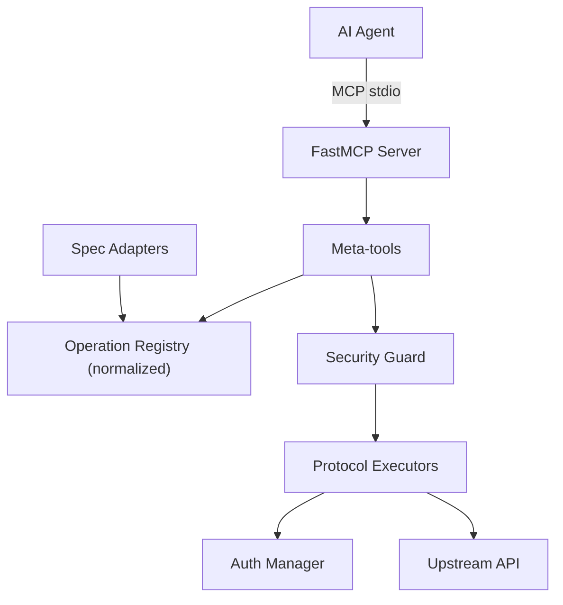

<!-- mcp-name: io.github.TeodorMCP/universal-connector-mcp -->

<div align="center">

# Universal API Connector MCP


### Any API. One MCP server.

Stop installing a new MCP server for every service: point this one at any OpenAPI/Swagger, GraphQL,<br>
gRPC or SOAP spec - or pick one from the built-in catalog of **2500+ public APIs** - and your AI agent<br>
can call it. Securely, in fewer steps, with fewer tokens.

[](https://github.com/TeodorMCP/universal-connector-mcp/actions)
[](https://pypi.org/project/universal-connector-mcp/)
[](pyproject.toml)
[](LICENSE)

[](cursor://anysphere.cursor-deeplink/mcp/install?name=universal-connector&config=eyJjb21tYW5kIjoidXZ4IiwiYXJncyI6WyJ1bml2ZXJzYWwtY29ubmVjdG9yLW1jcCJdfQ==)

[Installation](#installation) · [Meta-tools](#meta-tools) · [API catalog](#built-in-api-catalog) · [Examples](#example-session) · [Configuration](#configuration) · [Security](#security-model)

</div>

## Why another one?

Most "universal API" MCP servers only speak REST/OpenAPI. This project is built around three differentiators:

1. **Truly universal** - a normalized `Operation` model with pluggable spec adapters (OpenAPI, GraphQL, gRPC, SOAP). Tools and executors never care which protocol produced an operation.
2. **Security-first / local-first** - a direct response to supply-chain attacks like the *AgentBaiting / FakeGit* campaign. Outbound requests are restricted to an allowlist, secrets never touch logs, responses are size-capped, and every call is audit-logged. No arbitrary code execution, no binary downloads, no telemetry.
3. **Built for context efficiency** - field-level response filtering, chained and parallel execution, and response caching mean whole workflows fit in one tool call and responses stay small.

## How it works


The agent explores APIs like a filesystem instead of loading hundreds of tools at once (which would blow up the context window on large APIs like Stripe). It searches for operations, inspects the ones it needs, then executes them.

<details>
<summary>Architecture (click to expand)</summary>



</details>

## Meta-tools

| Tool | Purpose |
| --- | --- |
| `search_catalog` | Find ready-to-load public APIs (curated list + APIs.guru directory, 2500+ specs) |
| `load_api` | Register an API from a spec URL/file (protocol auto-detected) |
| `list_apis` | List loaded APIs |
| `search_operations` | Fuzzy-search operations across loaded APIs |
| `get_operation` | Full parameter/response schema for one operation |
| `execute` | Call an operation (auth + security guard applied); `extract` returns only the fields you ask for |
| `execute_chained` | Run a sequence of operations in one call, piping results between steps; nested lists run in parallel |
| `unload_api` | Remove a loaded API |
| `audit_log` | Recent outbound calls (method, host, path, status) |

## Why fewer steps (and fewer tokens)


Where a per-API MCP server needs one tool round-trip per call - each returning a full JSON payload into the agent's context - this server collapses whole workflows:

- **`extract`** - `execute(..., extract=["items.*.name", "total_count"])` returns just those fields instead of a multi-kilobyte response. `*` fans out over arrays.
- **Chaining** - `execute_chained` pipes step results into later params via `${save_as.path}` references: one tool call instead of N.
- **Parallel groups** - a nested list of steps runs concurrently, so "query three APIs and combine" is still one call:

```text
execute_chained(steps=[
  [
    {"operation_id": "github.repos_get", "params": {"owner": "o", "repo": "r"},
     "save_as": "gh", "extract": ["stargazers_count"]},
    {"operation_id": "open_meteo.get_v1_forecast", "params": {"latitude": 52.5, "longitude": 13.4},
     "save_as": "weather", "extract": ["current_weather.temperature"]}
  ],
  {"operation_id": "github.issues_list_for_repo",
   "params": {"owner": "o", "repo": "r"}, "extract": ["*.title"]}
])
```

- **Response cache** - successful GET/query results are cached for `UCMCP_CACHE_TTL` seconds (default 60), so repeated lookups are instant and free; pass `fresh: true` to bypass. Successful mutations invalidate that API's cached reads.

## Built-in API catalog

You don't need to hunt for spec URLs. `search_catalog` searches two sources:

1. A **curated list** of verified free/popular APIs: GitHub, GitLab, Stripe, OpenAI, Wikipedia, Open-Meteo (weather, no key), a countries GraphQL API, httpbin and the Swagger Petstore. Entries carry working spec URLs, base-URL overrides and auth hints (e.g. "optional GITHUB_TOKEN").
2. The [APIs.guru](https://apis.guru) directory - 2500+ community-indexed OpenAPI specs (Google, AWS, Microsoft, Twilio, NASA, ...), fetched once per session and searched locally.

```text
search_catalog(query="weather forecast")
  -> [{"name": "open_meteo", "spec": "https://...forecast.yml", "base_url": "https://api.open-meteo.com", ...}]
load_api(spec="https://...forecast.yml", name="open_meteo", base_url="https://api.open-meteo.com")
execute(operation_id="open_meteo.get_v1_forecast", params={"latitude": 52.52, "longitude": 13.41, "hourly": "temperature_2m"})
```

The catalog is discovery-only: it returns spec URLs, never loads or executes anything itself, so the security guard still applies to everything you load from it.

## Installation

The server runs in any MCP host via [`uvx`](https://docs.astral.sh/uv/) - no manual install needed, the package is fetched from [PyPI](https://pypi.org/project/universal-connector-mcp/) automatically (add `[all]` for GraphQL/gRPC/SOAP support):

```json
{
  "mcpServers": {
    "universal-connector": {
      "command": "uvx",
      "args": ["universal-connector-mcp"],
      "env": { "UCMCP_ALLOWED_HOSTS": "api.github.com" }
    }
  }
}
```

From source (development): `pip install -e ".[all,dev]"` and use `"command": "universal-connector-mcp"` instead. Extras: `graphql`, `grpc`, `soap`, `keyring`, `all`, `dev`; the core install supports OpenAPI/REST only.

### Cursor

[](cursor://anysphere.cursor-deeplink/mcp/install?name=universal-connector&config=eyJjb21tYW5kIjoidXZ4IiwiYXJncyI6WyJ1bml2ZXJzYWwtY29ubmVjdG9yLW1jcCJdfQ==)

One click via the badge above, or add the JSON block to `.cursor/mcp.json` in your project (shared with your team) or `~/.cursor/mcp.json` (personal, all projects). See [`examples/mcp.json`](examples/mcp.json) for a full config with credentials.

### Claude Desktop

Add the same `mcpServers` block to `claude_desktop_config.json` (Settings > Developer > Edit Config).

### Claude Code

```bash
claude mcp add universal-connector -- uvx universal-connector-mcp
```

### VS Code (Copilot)

Add the server under `"servers"` in `.vscode/mcp.json`:

```json
{
  "servers": {
    "universal-connector": { "command": "uvx", "args": ["universal-connector-mcp"] }
  }
}
```

### Windsurf / Cline / others

All major MCP hosts accept the same `mcpServers` block shown above in their respective config files (`~/.codeium/windsurf/mcp_config.json`, Cline's MCP settings, etc.).

> AI agents installing this server for a user: follow [llms-install.md](llms-install.md).

### Preloading APIs

Point `UCMCP_APIS_CONFIG` at a YAML file to auto-load APIs at startup - see [`examples/apis.example.yaml`](examples/apis.example.yaml).

### Managing APIs from chat

You never edit config files to manage APIs - just tell your agent:

- *"Connect the Stripe API"* - the agent finds it in the catalog and loads it.
- *"What APIs are connected?"* - `list_apis` shows them.
- *"Forget GitHub"* - `unload_api` removes it (and from the remembered state).

When an API needs credentials, `load_api` tells the agent exactly which environment variable to set (e.g. `STRIPE_API_KEY`), whether it is already configured, and the agent relays copy-pasteable instructions - you add the variable to the `env` block of your MCP config and restart. Secrets are never typed into the chat.

### Session persistence

The server remembers which APIs you loaded (their spec locations - never credentials or response data) in `UCMCP_STATE_FILE` and restores them automatically on the next start, so the agent can pick up right where it left off. Set `UCMCP_STATE_FILE=off` to disable.

## Supported protocols

| Protocol | Spec source | Notes |
| --- | --- | --- |
| OpenAPI / Swagger | OpenAPI 3.x or Swagger 2.0 (JSON/YAML), URL/file/raw | Core install. Local `$ref` resolution, all HTTP methods. |
| GraphQL | Introspection JSON or SDL | `pip install '.[graphql]'`. Auto-generates selection sets; `execute` accepts a `fields` override. |
| gRPC | Server reflection (`grpc://host:port`) | `pip install '.[grpc]'`. Unary-unary methods; reflection must be enabled server-side. |
| SOAP | WSDL (URL/file/raw) | `pip install '.[soap]'`. One `body` object parameter per operation. |

Each loaded operation gets an id namespaced as `<api>.<operation>` (e.g. `github.repos_get`).

## Example session

> More walkthroughs (weather, GitHub with auth, GraphQL, parallel multi-API workflows, internal APIs): [docs/EXAMPLES.md](docs/EXAMPLES.md)

```text
search_catalog(query="github")
load_api(spec="https://raw.githubusercontent.com/github/rest-api-description/main/descriptions/api.github.com/api.github.com.json", name="github")
search_operations(query="list repositories for user", api="github")
get_operation(operation_id="github.repos_list_for_user")
execute(operation_id="github.repos_list_for_user", params={"username": "torvalds"},
        extract=["*.name", "*.stargazers_count"])
```

GraphQL with field selection:

```text
load_api(spec="https://countries.trevorblades.com/", protocol="graphql", name="countries")
execute(operation_id="countries.country", params={"code": "US", "fields": "name capital currency"})
```

Chaining (feed one result into the next; wrap steps in a nested list to run them in parallel):

```text
execute_chained(steps=[
  {"operation_id": "github.repos_list_for_user", "params": {"username": "torvalds"}, "save_as": "repos"},
  {"operation_id": "github.repos_get", "params": {"owner": "torvalds", "repo": "${repos.data.0.name}"},
   "extract": ["description", "stargazers_count"]}
])
```

## Configuration

All settings are environment variables prefixed with `UCMCP_`:

| Variable | Default | Description |
| --- | --- | --- |
| `UCMCP_ALLOWED_HOSTS` | (empty) | Comma-separated extra hosts allowed for outbound calls. Prefix with `.` for suffix matches. |
| `UCMCP_DENIED_HOSTS` | (empty) | Comma-separated hosts always blocked (wins over allow). |
| `UCMCP_ALLOW_ALL_HOSTS` | `false` | Disable the allowlist entirely (not recommended). Does not disable private-IP blocking. |
| `UCMCP_BLOCK_PRIVATE_IPS` | `true` | Block outbound calls that resolve to private/loopback/link-local/cloud-metadata IPs (SSRF protection). |
| `UCMCP_MAX_REDIRECTS` | `5` | Max HTTP redirects to follow; every hop is re-checked against the guard. |
| `UCMCP_MAX_RESPONSE_BYTES` | `100000` | Response body cap sent back to the agent. |
| `UCMCP_HTTP_TIMEOUT` | `30` | Per-request timeout (seconds). |
| `UCMCP_MAX_RETRIES` | `2` | Retries on transient HTTP failures (429/502/503/504). |
| `UCMCP_CACHE_TTL` | `60` | Seconds to cache successful GET/query responses (`0` disables). |
| `UCMCP_AUDIT_ENABLED` | `true` | Toggle audit logging. |
| `UCMCP_AUDIT_FILE` | (none) | Append audit entries to this file (JSON lines). |
| `UCMCP_USE_KEYRING` | `false` | Also resolve secrets from the OS keyring. |
| `UCMCP_APIS_CONFIG` | (none) | Path to a YAML file of APIs to preload at startup. |
| `UCMCP_STATE_FILE` | `~/.universal-connector-mcp/state.json` | Where loaded APIs are remembered between restarts (spec locations only - never secrets or data). Set to `off` to disable. |

Credentials are looked up by convention from `<API_NAME>_TOKEN`, `<API_NAME>_API_KEY`, `<API_NAME>_CLIENT_ID` / `<API_NAME>_CLIENT_SECRET` (OAuth2 client credentials), etc.

## Development

```bash
pip install -e ".[all,dev]"
pytest          # run the test suite
ruff check .    # lint
```

The test suite (60+ tests) and lint run in CI on Ubuntu and Windows with Python 3.10 and 3.12 on every push ([.github/workflows/ci.yml](.github/workflows/ci.yml)); tagging `v*` builds and publishes to PyPI via trusted publishing ([.github/workflows/release.yml](.github/workflows/release.yml)).

Contributions welcome - see [CONTRIBUTING.md](CONTRIBUTING.md). Security reports go through [private reporting](SECURITY.md).

Releases are automated: tagging `v*` publishes to PyPI via trusted publishing (see [docs/RELEASING.md](docs/RELEASING.md)).

## Security model

- **Outbound allowlist** - by default only hosts of explicitly loaded specs are reachable. Extend/limit via `UCMCP_ALLOWED_HOSTS` / `UCMCP_DENIED_HOSTS`.
- **SSRF protection** - requests that resolve to private, loopback, link-local, reserved or cloud-metadata addresses are blocked (including spec fetches, GraphQL introspection and SOAP imports). Every redirect hop is re-validated. Reaching an internal address requires an explicit `UCMCP_ALLOWED_HOSTS` entry.
- **Secret handling** - credentials come from environment variables or the OS keyring, are injected only at request time, and are redacted from audit logs and errors.
- **Response caps** - responses are truncated to a configurable byte limit to protect the context window.
- **Audit log** - method, host, path and status of every outbound call (never secrets or bodies) are recorded.

## License

MIT
